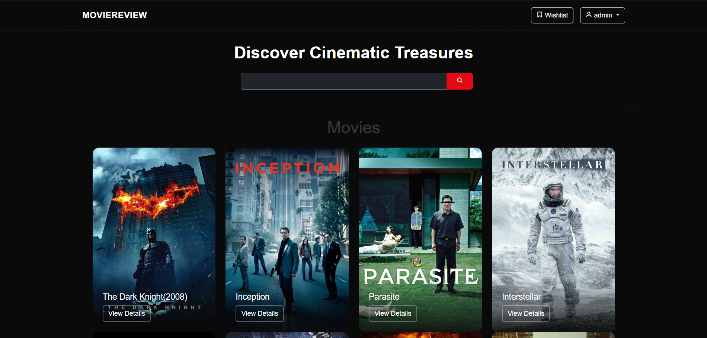
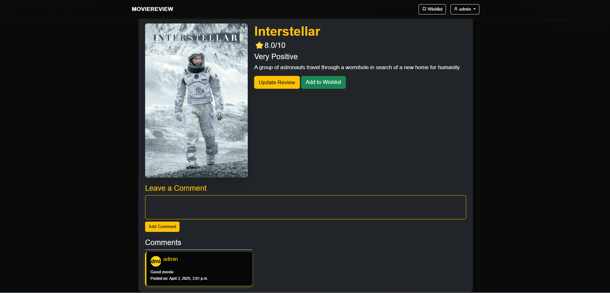

# Movie Review Website

A movie review platform built with Django and Bootstrap.
## Screenshots
### Homepage


### Movie Detail Page


## Features
- User authentication (Signup/Login/Logout)
- Movie listing with descriptions and images
- Wishlist functionality
- Responsive UI similar to IMDb

## Installation

### Prerequisites
Ensure you have the following installed:
- Python (>=3.10)
- Django
- Virtual environment (optional but recommended)

### Steps
1. Clone the repository:
   ```sh
   git clone https://github.com/SouvagyaCode/Movie-Review.git
   cd movie-review-site
   ```
2. Create and activate a virtual environment (optional but recommended):
   ```sh
   python -m venv venv
   source venv/bin/activate  # On Windows use `venv\Scripts\activate`
   ```
3. Install dependencies:
   ```sh
   pip install -r requirements.txt
   ```
4. Apply migrations:
   ```sh
   python manage.py migrate
   ```
5. Create a superuser (for admin access):
   ```sh
   python manage.py createsuperuser
   ```
6. Run the server:
   ```sh
   python manage.py runserver
   ```
7. Open your browser and visit `http://127.0.0.1:8000/` to access the website.


## License
This project is licensed under the MIT License.

